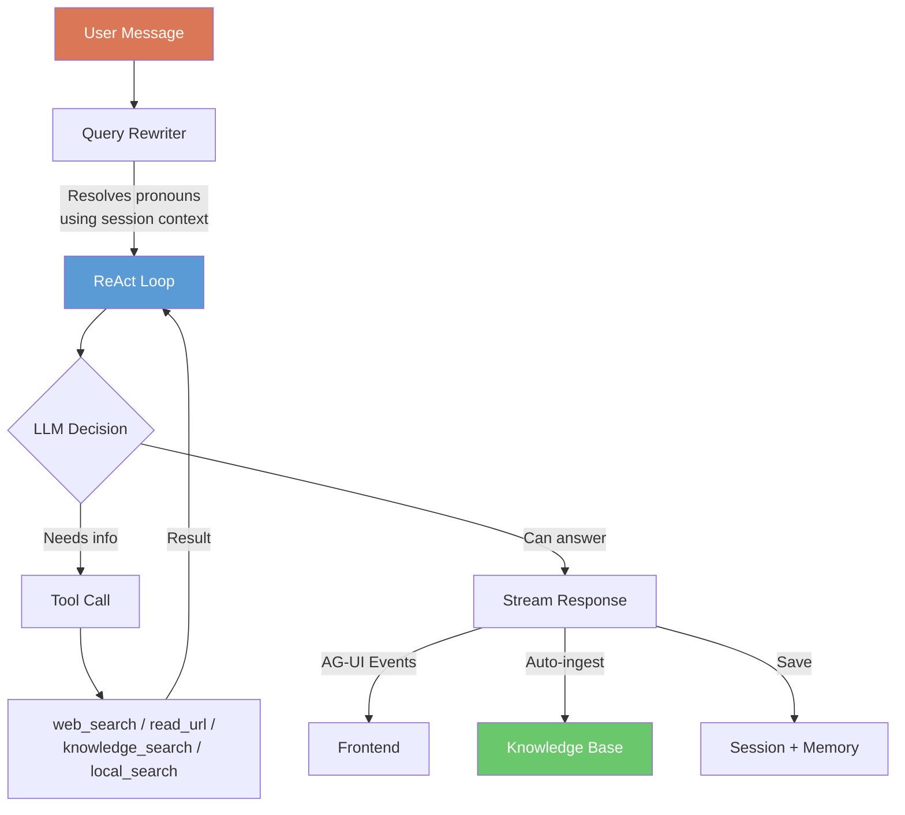
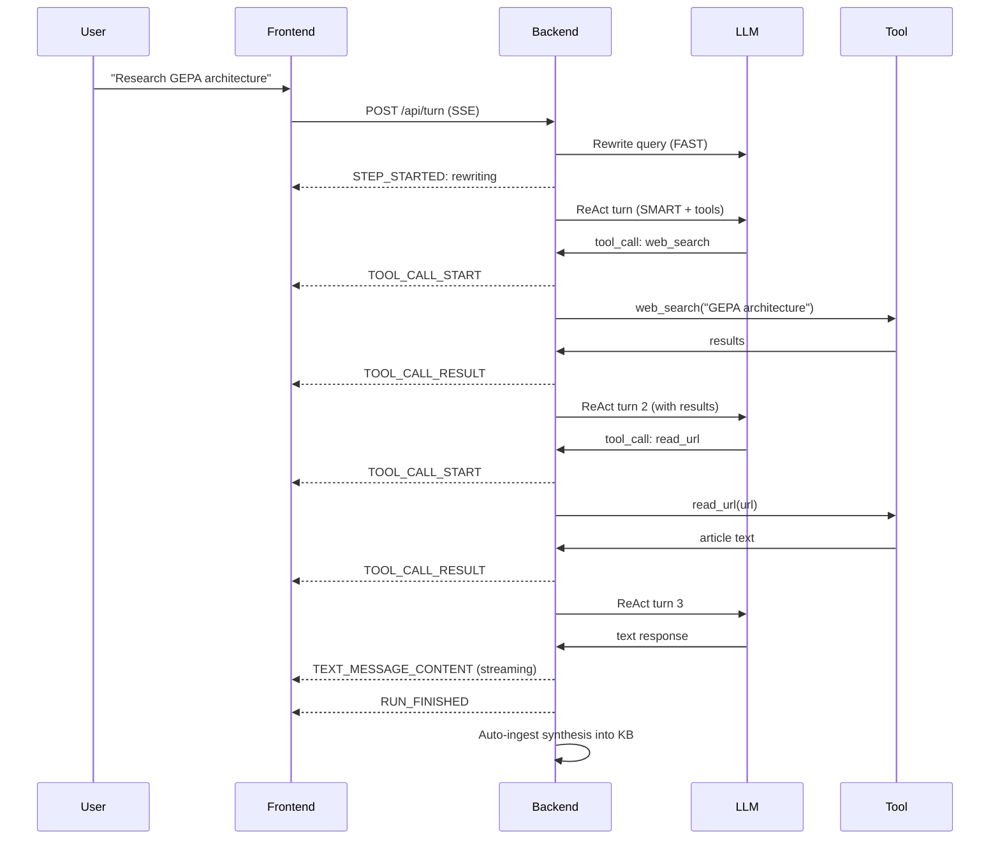
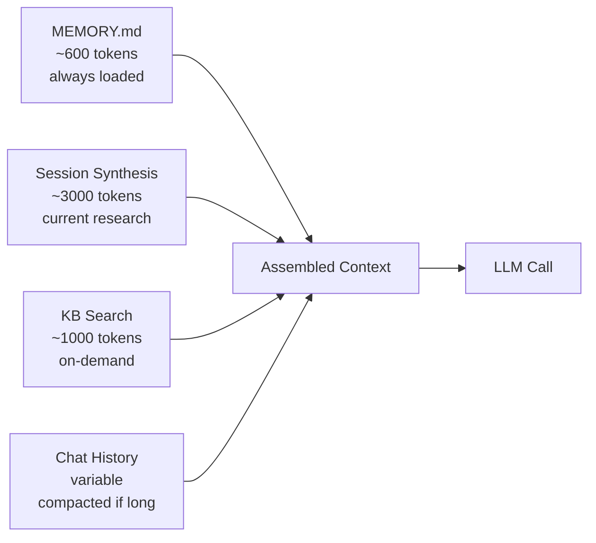

<p align="center">
  
</p>

<h1 align="center">Planex</h1>

<p align="center">
  <em>AI Research Assistant with Persistent Knowledge Base</em>
</p>

<p align="center">
  
  
  
  
  
</p>

---

An autonomous AI agent that breaks complex research goals into plans, executes them using real tools, and builds a persistent knowledge base that grows smarter over time.

**No agent frameworks** (LangChain, CrewAI, etc.) — custom Python with asyncio, structured output via Pydantic, and the [AG-UI protocol](https://github.com/ag-ui-protocol/ag-ui) for event streaming.

## How It Works

Every user message — whether a new research goal or a follow-up question — goes through the same **unified ReAct loop**:



The agent decides on each turn whether to search the web, query the knowledge base, read a URL, or answer directly from context. No separate code paths for "research" vs "chat."

## Key Features

1. **Unified ReAct Loop** — one path for everything. The LLM gets tools and decides whether to use them. Can chain multiple tool calls (search → read → search again) within a single turn.

2. **AG-UI Event Streaming** — every tool call, result, and text chunk is emitted as a typed [AG-UI event](https://github.com/ag-ui-protocol/ag-ui) via SSE. The frontend renders tool activity in real-time.

3. **Three-Tier LLM Strategy** — cheap model for summaries (FAST), capable model for tool dispatch (SMART), reasoning model for planning (STRATEGIC). Each tier independently configurable.

4. **Structured Output Everywhere** — all LLM calls returning structured data use Pydantic models with OpenAI's native `client.beta.chat.completions.parse()`. Zero parsing failures.

5. **Persistent Knowledge Base** — LanceDB vector store that grows silently. Session syntheses auto-ingest. Users can upload files, paste URLs, or drop documents. Every chunk carries structured metadata (`KBChunkMetadata`).

6. **Session-Aware Follow-ups** — query rewriter resolves "them", "it", "this" using the session's research context before the LLM sees the message. Follow-ups have full tool access.

7. **Three-Layer Memory** — short-term (conversation), long-term (`MEMORY.md` with extracted learnings), and knowledge (LanceDB). Memory flush before context compaction prevents amnesia.

8. **Rich Artifacts** — the frontend renders `mermaid` diagrams, `chart` visualizations, `cards` dashboards, and `choices` interactive disambiguation cards directly from markdown code blocks.

9. **Desktop + Web + CLI** — native macOS app (pywebview), web app (React + FastAPI), and CLI for scripting. Same backend, same agent.

## Quick Start

### Docker (any OS — recommended)

```bash
git clone https://github.com/Amineelfarssi/planex.git
cd planex
echo "OPENAI_API_KEY=sk-..." > .env
docker compose up
# Open http://localhost:8000
```

### Native Install (macOS / Linux)

```bash
make install   # Python venv + npm deps
make run       # desktop app (macOS native window)
make dev       # web app (backend :8000 + frontend :3000)
```

Other commands:

```bash
make serve     # backend only
make research  # CLI one-shot
make clean     # remove build artifacts
```

On first run, Planex will ask for your OpenAI API key and create `~/.planex/`.

## Architecture

### Three-Tier LLM

| Tier | Model | Reasoning | Purpose |
|------|-------|-----------|---------|
| FAST | gpt-5-nano | auto | Rewriting, routing, summaries, metadata extraction |
| SMART | gpt-5-mini | auto | Tool dispatch, synthesis, follow-up responses |
| STRATEGIC | gpt-5.1 | `high` | Planning and decomposition |

> **Note:** `gpt-5.1` defaults to `reasoning_effort: none`. We explicitly set `high` — without this, planning quality drops significantly.

### Structured Output Models

All LLM calls returning structured data use Pydantic models defined in [`core/models.py`](core/models.py):

```python
class ResearchPlan(BaseModel):
    plan_title: str
    tasks: list[PlanTask]

class RewrittenQuery(BaseModel):
    query: str
    changed: bool

class KBChunkMetadata(BaseModel):
    source: str
    source_type: str  # local_file | web_page | session_synthesis
    doc_title: str
    ingested_by: str  # user_upload | session:<plan_id>
    tags: list[str]
    file_hash: str    # SHA-256 for dedup
    # ... 12 fields total
```

### Tools

| Tool | Source | When Used |
|------|--------|-----------|
| `web_search` | OpenAI Responses API | Current info, no extra API key |
| `read_url` | httpx + trafilatura | Deep-read articles from search results |
| `knowledge_search` | LanceDB vectors | Find past research and ingested docs |
| `local_search` | grep (ripgrep-style) | Text search over workspace files |
| `ingest_documents` | LanceDB | Add files to KB |
| `read_file` / `write_file` | filesystem | Local file I/O |
| `get_current_time` | datetime | Time as tool, not in system prompt (preserves caching) |

### Event Flow



### Context Strategy



## Frontend

Conversation-first layout inspired by Claude Desktop:

- **Hamburger sidebar** — sessions, memory peek, sources (upload/URL/paste/drop)
- **Hero** — time-aware greeting with animated orbital logo
- **Main area** — research execution + streaming follow-up chat
- **Document panel** — collapsible right pane with downloadable research report
- **Dark/light theme** — toggle in header
- **Rich rendering** — mermaid, charts, cards, choice cards, copy buttons

## Evaluation Scenarios

| Scenario | What to Test | Success Criteria |
|----------|-------------|-----------------|
| Web research | "Research GEPA architecture" | Topic-specific plan, web search results, cited synthesis |
| Follow-up with tools | After research, ask "compare to transformers" | Query rewritten, tools called if needed, uses session context |
| Document ingestion | Upload PDF, ask about content | File ingested, KB finds it, answer cites document |
| Cross-session knowledge | Research A, new session asks related question | KB search finds prior research |
| Disambiguation | Short ambiguous query | Choice cards rendered, user clicks, research proceeds |

## Project Structure

```
planex/
├── core/
│   ├── react_loop.py       # Unified ReAct loop with AG-UI events
│   ├── models.py           # ALL Pydantic models (structured output)
│   ├── llm.py              # Three-tier LLM (chat, chat_parse, chat_stream, embed)
│   ├── agent.py             # Orchestrator
│   ├── planner.py           # Goal → task plan
│   ├── executor.py          # Parallel execution + synthesis
│   ├── knowledge.py         # LanceDB with KBChunkMetadata
│   ├── memory.py            # MEMORY.md + daily notes + flush
│   ├── state.py             # Session persistence
│   └── context.py           # Context assembly pipeline
├── tools/                   # web_search, read_url, local_search, knowledge_search, ...
├── dashboard/app.py         # FastAPI: /api/turn (SSE), REST endpoints
├── frontend/                # React + Vite + Tailwind + Zustand
├── desktop.py               # Native macOS app (pywebview)
└── cli/app.py               # Minimal CLI: serve, run, ingest, status
```

## Trade-offs

| Decision | Choice | Rationale |
|----------|--------|-----------|
| No agent framework | Custom ReAct loop | Assignment requirement; cleaner to explain |
| OpenAI web search | Responses API | Zero extra API keys — uses existing OpenAI key |
| AG-UI protocol | `ag-ui-protocol` package | Open standard, typed events, not a framework |
| Structured output | Pydantic + `parse()` | Type-safe, zero parsing failures |
| KB as invisible tool | Not a UI tab | Grows silently, no management overhead |
| gpt-5.1 reasoning | Explicit `high` | Defaults to `none` — dramatic quality difference |
| Single ReAct path | No chat vs research split | Simpler, every message can use tools |

## License

MIT
